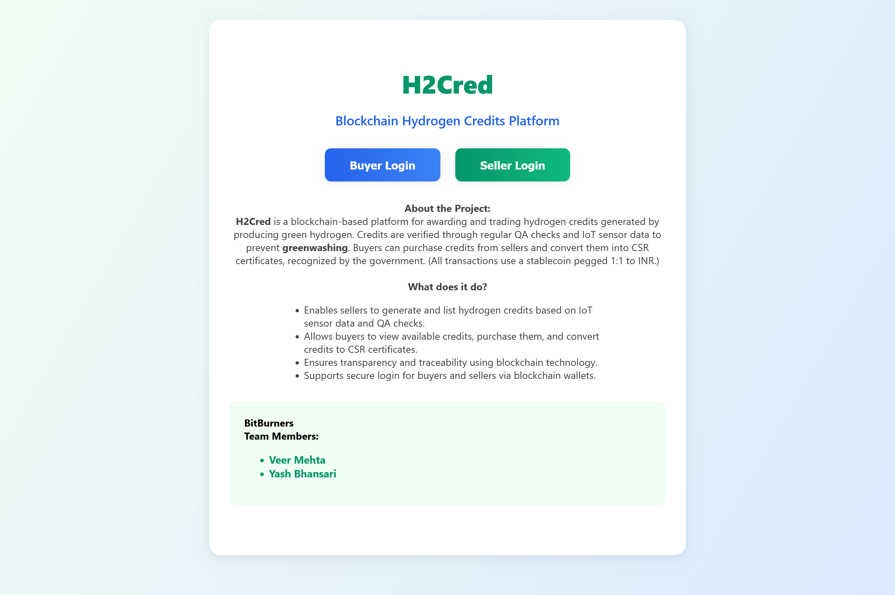
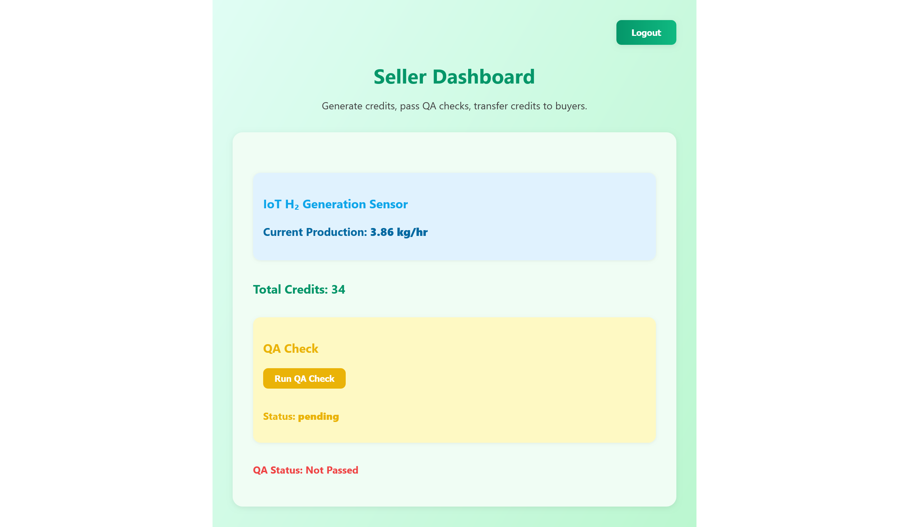

# H2Cred

A Solidity-based smart contract project for buying, transferring, and managing hydrogen credits on the Ethereum blockchain. This project uses Hardhat for development, testing, and deployment.

## Screenshots

### Landing Page


### Seller Dashboard


### Buyer Dashboard


## Project Structure

- `contracts/HydrogenCredit.sol` — Main Solidity smart contract for hydrogen credits.
- `scripts/deploy.js` — Script to deploy the contract to the Sepolia testnet.
- `test/h2test.js` — Hardhat/Chai test suite for contract functionality.
- `hardhat.config.js` — Hardhat configuration (uses Sepolia testnet, Solidity 0.8.20).
- `artifacts/` and `cache/` — Build artifacts and cache (auto-generated by Hardhat).
- `package.json` — Project dependencies and scripts.

## Prerequisites

- [Node.js](https://nodejs.org/) (v14 or higher recommended)
- [Hardhat](https://hardhat.org/)
- An [Alchemy](https://alchemy.com/) API key for Sepolia
- A Sepolia testnet account with ETH and private key

## Setup

1. **Clone the repository:**
   ```sh
   git clone https://github.com/veer-mehta/h2cred.git
   cd h2cred
   ```
2. **Install dependencies:**
   ```sh
   npm install
   ```
3. **Configure environment variables:**
   Create a `.env` file in the root directory with:
   ```env
   ALCHEMY_URL=your_sepolia_alchemy_url
   PRIVATE_KEY=your_metamask_sepolia_private_key
   ```

## Usage

### Compile Contracts
```sh
npx hardhat compile
```

### Run Tests
```sh
npx hardhat test
```

### Deploy to Sepolia
```sh
npx hardhat run scripts/deploy.js
```

## Contract Features
- **Buy Credits:** Users can buy hydrogen credits by sending ETH.
- **Transfer Credits:** Users can transfer credits to other addresses.
- **Track Credits:** The contract tracks credits per address.
